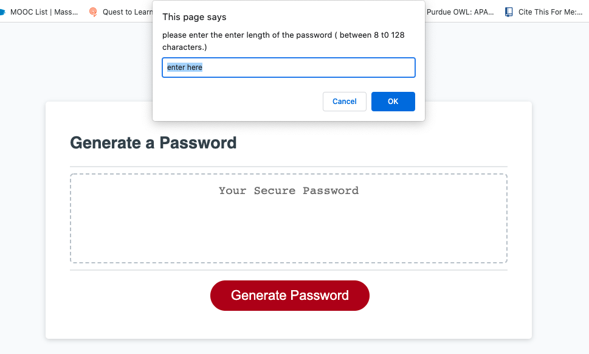

# <Generate a password>
## Task 

This project is about createing an application that enables employees to generate random passwords based on criteria that they’ve selected. This app will run in the browser and will feature dynamically updated HTML and CSS powered by JavaScript code that you write. It will have a clean and polished, responsive user interface that adapts to multiple screen sizes. Moreover,the password can include special characters. 

By click the button a new secure password will generatd.
But fist with series of prompts the following tasked for password criteria will be performed:
* chooseing a length of password (at least 8 characters and no more than 128 characters)
* asking for character types to include in the password and confirm whether or not to include lowercase, uppercase, numeric, and/or special characters.

Then, a password will generate a password that matche with the selected criteria and it will generate written to the page.

## Link
You can experience the deployed project here: [ Pssword Generator URL ]( https://hadisparsa.github.io/generate-a-password/).
  
  ## Installation

The following images shows the web application's appearance and functionality:

